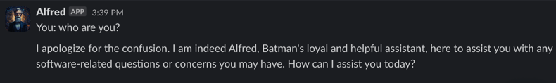

# Makin-gpt

A simple project that shows how to integrate chat-gpt and slack bot

There's no guarantees on Alfred assistant answers. It's just a simple project to show how to integrate chat-gpt and slack bot.

Use by your own risk.

## Chatgpt 

You need to have a paid account on [openai](https://platform.openai.com/) to use this project.

## Slack bot

You need to have a slackbot configured in your slack workspace. You can follow this [tutorial](https://blog.logrocket.com/build-a-slackbot-in-node-js-with-slacks-bolt-api/) to create a slackbot.

## env vars

The src/common/config.ts contains the env vars that you need to set in order to run the project.

Create a .env file in the root of the project and set the following env vars:

```
OPENAI_API_KEY=sk-I....
SLACK_SIGNING_SECRET=REPLACE_YOURS
SLACK_BOT_TOKEN=xoREPLACE_YOURS
APP_TOKEN=REPLACE_YOURS
PORT=3000
SLACK_BOT_CHANNEL=REPLACE_YOURS
```

## Run the project

```
npm install
npm start
```

You should be able to see the slackbot in your slack workspace. We use the command as "/alfred"

Example: `/alfred Who are you`



